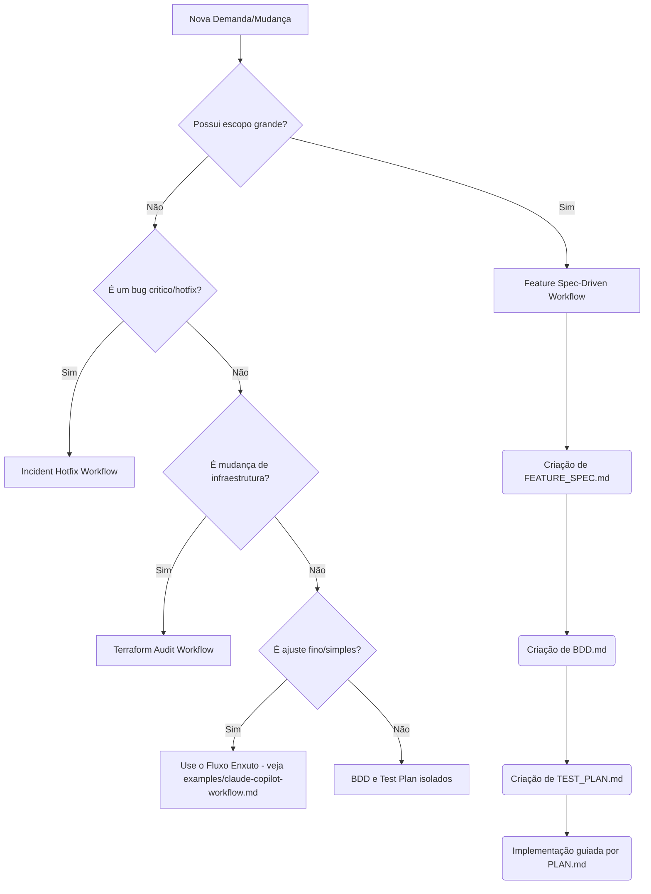

# Sistema Operacional de Engenharia Assistida por IA

Este repositório é um **Sistema Operacional de Engenharia Assistida por IA**. Ele não é um produto, biblioteca de runtime, nem framework de aplicação. Ele é um conjunto centralizado de regras, diretrizes, agentes, workflows e templates projetados para impor um **desenvolvimento guiado por especificações (spec-driven)** com o apoio de ferramentas de IA (Copilot, Cursor, etc.).

---

## 1. O Que É Este Repositório?

Esta é a fundação para times de engenharia que desejam integrar IA em seu dia a dia sem perder o rigor técnico. Ele define:
- Como uma tarefa (história) é fatiada.
- Como a especificação e os critérios de aceite (BDD) são definidos.
- Como as instruções do sistema orientam agentes autônomos.
- Como o código é desenvolvido, testado e auditado por IA.

## 2. O Que Ele Não É?

- Não é um framework de aplicação.
- Não é uma biblioteca instalada via npm/pip.
- Não contém código de negócio.
- Não substitui o julgamento final de um engenheiro humano.

## 3. Estrutura do Repositório

```text
├── general/
│   └── copilot/             # Camada geral: agentes, skills e instruções reutilizáveis (instalado na máquina do dev)
├── repo-specific/
│   └── templates/           # Camada específica: configurações e templates a serem copiados para repositórios reais
├── workflows/               # Rotinas passo-a-passo e workflows de alto nível
├── templates/               # Artefatos canônicos da feature (SPEC, BDD, etc.)
├── examples/                # Exemplos práticos e workflow enxuto para o dia a dia
└── docs/                    # Documentação do próprio sistema operacional
```

## 4. Camada Geral vs Camada Específica

Para a IA ser eficaz, ela precisa de instruções gerais sobre qualidade e contexto local sobre o repositório.

- **Camada Geral (`general/copilot/`)**: Fica na raiz do perfil/sistema do desenvolvedor (ex: `C:\Users\<USER>\.copilot\`). Contém coisas que **não dependem do repositório**. Princípios de design, instruções de segurança, agentes genéricos (ex: `security-auditor`).
- **Camada Específica (`repo-specific/templates/`)**: Fica dentro do próprio repositório de produto gerado (`.github/copilot-instructions.md`). Contém a **verdade local**: qual logger usar, como rodar testes (`npm run test:watch`), qual ORM o projeto adota.

**Regra de ouro:** A IA nunca deve tentar adivinhar a verdade local. Se algo é específico do projeto, vai na camada específica.

## 5. Instalação (Windows)

A Camada Geral deve ser copiada para a pasta base do seu usuário:

1. Abra o PowerShell.
2. Crie a raiz do Copilot/Agent na sua home:
   ```powershell
   mkdir C:\Users\<USER>\.copilot\
   ```
3. Copie as pastas `instructions`, `skills` e `agents` do diretório `general/copilot/` deste projeto para `C:\Users\<USER>\.copilot\`.

A Camada Específica e Templates vão para os repositórios reais:
1. No seu repositório de código fonte (ex: `locadora-api/`), copie o conteúdo de `repo-specific/templates/`.
2. Preencha `.github/copilot-instructions.md` com a verdade do projeto.

## 6. Dinâmica e Uso no Dia a Dia

- **Agents**: São personas. Peça a IA para atuar como `@pm-bdd-manager` ou `@security-auditor`.
- **Skills**: São capacidades granulares com inputs e outputs rigorosos. Por exemplo, executar `unit-test-ts`.
- **Workflows**: São processos estruturados que encadeiam múltiplas skills. Ex: `feature-spec-driven`.

**Exemplo (Locadora de Veículos)**:
Ao invés de pedir: *"Crie uma rota para registrar multa de atraso na devolução"*, você inicia o **Workflow Spec-Driven**:
1. Ativa o `pm-bdd-manager` e alimenta o contexto: *"Adicionar fluxo de devolução com multa por atraso"*.
2. A IA gera a `FEATURE_SPEC.md` e o `BDD.md`. Você revisa.
3. A IA gera o plano de execução (`PLAN.md`).
4. Ativa o engneer agent (`pair-engineer-ts`) que executa o `PLAN.md` fatiado.
5. Inicia o `test-auditor` para gerar testes aderentes ao BDD.

## 7. Fluxo Spec-Driven

O coração deste repositório é que nenhum código deve ser tocado antes da IA documentar e ter as partes acordadas de antemão:

1. **História / Intake**: Recebimento da demanda de negócio.
2. **Especificação**: Geração de `doc/FEATURE_SPEC.md`.
3. **BDD**: Escrita dos cenários em `doc/BDD.md`.
4. **Test Plan**: Geração do `doc/TEST_PLAN.md`.
5. **Plan**: Roteirização do que será feito (`doc/PLAN.md`).
6. **Implementação**: Escrita do código em slices (com updates de `doc/STATUS.md`).
7. **Verificação & Auditoria**: Conferência com `doc/AUDIT.md`.
8. **Gate Pré-Merge**: Liberação para Pull Request.

## 8. Fluxograma de Decisão: Quando usar o quê?



## 9. Fluxos Recomendados

- **Adição de Funcionalidade Core** (Ex: *Processamento assíncrono de confirmação de reserva*): Usar rigorosamente o workflow `feature-spec-driven.md`.
- **Mudança de Infra** (Ex: *Limitação de tráfego usando Terraform*): Usar a instrução `terraform-review.instructions.md`.
- **Feature Menor** (Ex: *Adicionar status de veículo "em manutenção"*): O roteiro de `bdd-scenario-authoring` e o test plan já fornecem o contorno suficiente.

## 10. Adoção Mínima para Começar

Se estiver lidando com um time que quer introduzir IA sem ser esmagado pela estrutura:
1. Comece apenas preenchendo as `.github/copilot-instructions.md` com os comandos essenciais.
2. Use a skill de `unit-test-ts` / `unit-test-python` para solidificar qualidade.
3. Não use a feature spec-driven completa no primeiro dia; faça os programadores se habituarem a pedir BDDs usando `bdd-scenario-authoring`.

## 11. Fluxo Enxuto para o Dia a Dia

Para tarefas pequenas a médias (bug fixes, features de 1-2 cenários, refactors, CRUD), use o **fluxo enxuto** documentado em [`examples/claude-copilot-workflow.md`](examples/claude-copilot-workflow.md).

Ele cobre:
- Setup do VSCode + Copilot com Claude
- Matriz de modelo (Haiku/Sonnet/Opus) por tipo de tarefa
- Templates de prompt copiáveis para cada situação
- Heurística de decisão em 30 segundos
- Anti-padrões a evitar

Use o fluxo completo (seção 7) apenas quando a tarefa tocar múltiplos serviços, exigir alinhamento com stakeholders, ou envolver mudanças irreversíveis.
